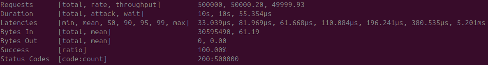
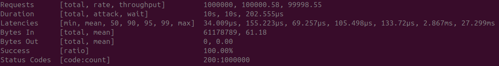

# Build a Fast GeoIP API in Rust with ntex

This article shows a step-by-step approach to building a small, high performance GeoIP HTTP API in Rust using `ntex`. In less than 120 lines of code.

## Why ntex?

- Runtime choice: `ntex` separates framework from the async runtime, letting you select implementations that best fit your latency and platform requirements.
- Ecosystem: `ntex` has runtime-consistent crates such as `ntex-redis`, `ntex-grpc`, `ntex-mqtt`, and `ntex-amqp` so you can add integrations that match the same runtime model.
- Low overhead: `ntex` aims for high-throughput servers and gives control over worker count and threading.

## Prerequisites

- Rust toolchain (stable). Install from [https://rustup.rs](https://rustup.rs) if needed.
- `cargo` available on PATH.
- MaxMind mmdb files placed under `./mmdb` available [here](https://github.com/P3TERX/GeoLite.mmdb)

## Install dependencies

Run these commands to add the dependencies used in this example. Each is chosen to fulfill a specific role:

- `ntex` - the web framework.
- `maxminddb` - reading MaxMind DB formats.
- `memmap2` - memory-map mmdb files for fast, zero-copy reads.
- `lru` - in-process LRU cache for repeated lookups.
- `anyhow` - ergonomic error handling for simple apps.
- `serde`, `serde_json` - JSON (de)serialization for responses.
- `num_cpus` - detect worker count.

```bash
cargo add ntex
cargo add maxminddb --features mmap
cargo add memmap2
cargo add lru
cargo add anyhow
cargo add serde --features derive
cargo add serde_json
cargo add num_cpus
```

Cargo.toml:

```toml
[package]
name = "geo-api"
version = "0.1.0"
edition = "2024"

[dependencies]
anyhow = "1.0.102"
lru = "0.16.3"
maxminddb = { version = "0.27.3", features = ["mmap"] }
memmap2 = "0.9.10"
ntex = { version = "3.7.0", features = ["tokio"] }
num_cpus = "1.17.0"
serde = { version = "1.0.228", features = ["derive"] }
serde_json = "1.0.149"
```

## Create a basic endpoint

Let's start with a basic endpoint for our api:

```rust
use ntex::web;

#[derive(serde::Deserialize)]
struct GeoIpQuery {
  ip: std::net::IpAddr,
}

#[web::get("/geoip")]
async fn geoip_handler(
  query: web::types::Query<GeoIpQuery>,
) -> web::HttpResponse {
  web::HttpResponse::Ok().json(&serde_json::json!({
    "message":"ok"
  }))
}

#[ntex::main]
async fn main() -> anyhow::Result<()> {
  let srv =
    web::HttpServer::new(async move || web::App::new().service(geoip_handler))
      .workers(num_cpus::get());
  srv.bind("0.0.0.0:8585")?.run().await?;
  Ok(())
}
```

Test the endpoint:

```bash
cargo run
curl 'http://localhost:8585/geoip?ip=8.8.8.8' | jq
```

Should output:

```json
{
  "message": "ok"
}
```

## Implement the logic

We will use a shared AppState struct to load the database once using mmap to avoid using too much memory and implement a sharded LRU cache to avoid locking mutex for too long

```rust
use std::hash::{Hash, Hasher};

use lru::LruCache;
use maxminddb::Reader;
use memmap2::Mmap;
use ntex::web;

const SHARD_SIZE: usize = 16;
const CACHE_SIZE: usize = 1024;

#[derive(serde::Deserialize)]
struct GeoIpQuery {
  ip: String,
}

#[derive(Clone, serde::Serialize)]
struct GeoIpResponse {
  country: Option<String>,
  city: Option<String>,
  asn: Option<String>,
}

struct CacheShard(std::sync::Mutex<LruCache<std::net::IpAddr, GeoIpResponse>>);

impl CacheShard {
  fn new() -> Self {
    let cache_size = std::num::NonZeroUsize::new(CACHE_SIZE).unwrap();
    Self(std::sync::Mutex::new(LruCache::new(cache_size)))
  }
  fn get(&self, ip: &std::net::IpAddr) -> Option<GeoIpResponse> {
    self.0.lock().ok()?.get(ip).cloned()
  }
  fn set(&self, ip: std::net::IpAddr, response: GeoIpResponse) {
    if let Ok(mut cache) = self.0.lock() {
      cache.put(ip, response);
    }
  }
}

struct AppInner(Reader<Mmap>, Reader<Mmap>, Vec<CacheShard>);

#[derive(Clone)]
struct AppState(std::sync::Arc<AppInner>);

impl AppState {
  fn open_mmap(path: &str) -> anyhow::Result<Reader<Mmap>> {
    Ok(Reader::from_source(unsafe {
      Mmap::map(&std::fs::File::open(path)?)?
    })?)
  }
  fn new() -> anyhow::Result<Self> {
    Ok(Self(std::sync::Arc::new(AppInner(
      Self::open_mmap("./mmdb/GeoLite2-City.mmdb")?,
      Self::open_mmap("./mmdb/GeoLite2-ASN.mmdb")?,
      (0..SHARD_SIZE).map(|_| CacheShard::new()).collect(),
    ))))
  }
  fn shard(&self, ip: &std::net::IpAddr) -> &CacheShard {
    let mut hasher = std::collections::hash_map::DefaultHasher::new();
    ip.hash(&mut hasher);
    &self.0.2[(hasher.finish() as usize) % SHARD_SIZE]
  }
  fn lookup(&self, ip: &str) -> anyhow::Result<GeoIpResponse> {
    let ip = ip.parse::<std::net::IpAddr>()?;
    let shard = self.shard(&ip);
    if let Some(v) = shard.get(&ip) {
      return Ok(v.to_owned());
    }
    let (country, city) = self
      .0
      .0
      .lookup(ip)?
      .decode::<maxminddb::geoip2::City>()?
      .map(|c| {
        (
          c.country.iso_code.map(|s| s.to_owned()),
          c.city.names.english.map(|s| s.to_owned()),
        )
      })
      .unwrap_or((None, None));
    let asn = self
      .0
      .1
      .lookup(ip)?
      .decode::<maxminddb::geoip2::Asn>()?
      .and_then(|a| a.autonomous_system_organization.map(|s| s.to_owned()));
    let result = GeoIpResponse { country, city, asn };
    shard.set(ip, result.to_owned());
    Ok(result)
  }
}

#[web::get("/geoip")]
pub async fn geoip_handler(
  app_state: web::types::State<AppState>,
  query: web::types::Query<GeoIpQuery>,
) -> web::HttpResponse {
  match app_state.lookup(&query.ip) {
    Err(_) => web::HttpResponse::InternalServerError().finish(),
    Ok(geoip) => web::HttpResponse::Ok().json(&geoip),
  }
}

#[ntex::main]
async fn main() -> anyhow::Result<()> {
  let app_state = AppState::new()?;
  let srv = web::HttpServer::new(async move || {
    web::App::new()
      .state(app_state.clone())
      .service(geoip_handler)
  })
  .workers(num_cpus::get());
  srv.bind("0.0.0.0:8585")?.run().await?;
  Ok(())
}
```

This implementation has been optimized for minimal line count at the expense of some readability and error handling.

## Test the service

Build and run locally:

```bash
cargo run
```

Try the endpoint:

```bash
curl 'http://127.0.0.1:8585/geoip?ip=8.8.8.8' | jq
```

Should return:

```json
{
  "country": "US",
  "city": null,
  "asn": "Google LLC"
}
```

## Optimize for speed

By adding these lines to your `Cargo.toml` you can optimize the binary for maximum speed

```toml
[profile.release]
opt-level = 3
lto = "fat"
panic = "abort"
codegen-units = 1
```

## Benchmark the endpoint

For fun mostly I will download a random list of ips and benchmark the endpoint using [vegeta](https://github.com/tsenart/vegeta)

I am testing this on localhost on an Intel i9-9900K CPU.
At high request rates, my CPU is mostly the bottleneck and the benchmark doesn't really reflect real world traffic.

Assuming you have a file with ip addresses on each line you can run:

```bash
cat ips.txt | shuf \
  | awk '{print "GET http://127.0.0.1:8585/geoip?ip=" $1}' \
  | vegeta attack -rate=50000 -duration=10s \
  | vegeta report
```

The result I have:



Which is pretty decent, I believe. To push the fun further, let's run it at 100k RPS

```bash
cat ips.txt | shuf \
  | awk '{print "GET http://127.0.0.1:8585/geoip?ip=" $1}' \
  | vegeta attack -rate=100000 -duration=10s \
  | vegeta report
```

My result:



Again, this is not a real world benchmark, but it shows the GeoIP API is robust and fast.


## Conclusion

Rust has a great ecosystem of crates that lets you write fast and robust services in a few lines of code!

You can see the source code on [github](https://github.com/0xle0ne/ntex-geoip-example).
